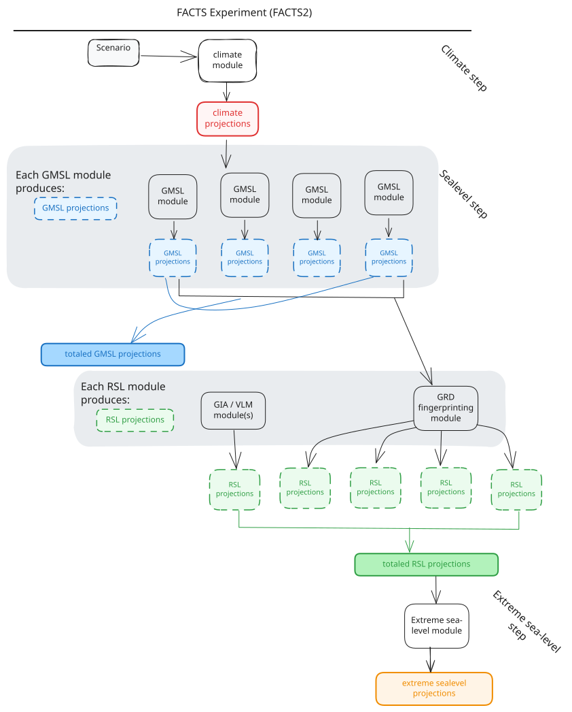

### A FACTS experiment

Typically, researchers link these modules together in specific ways to estimate distributions of sea level change. The linked modules, known as a FACTS "experiment", follow a set of steps that are run in sequence:

#### 1. Climate step
- Produces global mean surface temperature (GMST) change and other relevant climate variables to drive sea level components. Available modules: see Module details → Climate step.

#### 2. Sea-level step
Produces sea-level change contributions. Multiple module choices for the same process let you explore structural uncertainty (different scientific models for the same physics). Modules are run in parallel if compute resources allow and represent the following components: \

  - i. vertical land motion  
  - ii. land ice (ice sheets and glaciers)  
  - iii. thermal expansion and ocean dynamics  
  - iv. land water storage   

Two types of sea-level projections can be produced by a FACTS module: global mean sea level (GMSL) and localized relative sea level (RSL).  

#### Global mean sea-level projections
  Some physical models produce estimates of the contribution of a physical process to global mean sea-level. GMSL projections have `(sample, year)` dimensions.  

##### Relative sea-level
  Other models generate projected relative sea-level change for a given location. These modules can include gravitational, rotational and deformational (GRD) effects, as well as vertical land motion processes such as glacial isostatic adjustment and subsidence. RSL projections have `(year, sample, location)` dimensions. 

#### 3. Totaling step
Produces total global and relative sea level change by summing outputs of step 2. Structural uncertainty can be explored by summing different component representations in separate "workflows". Available modules: see Module details → Totaling step.

#### 4. Extreme sea-level step
Computes return levels and other extreme sea-level statistics from totaled sea-level projections and historical tide-gauge data. Available modules: see Module details → Extreme sea-level step.

The diagram below shows a visual representation of a FACSTS experiment. Modules are indicated as white boxes with black borders. Projections, generated by modules, are shown as shaded boxes with dashed borders.
<figure markdown="span">

{width="600"}
<figcaption> Diagram of a FACTS experiment. </figcaption>
</figure>

## Configuring FACTS experiments

FACTS2 experiments are defined using YAML configuration files. These can be hand-written or generated using [facts-experiment-builder](https://github.com/fact-sealevel/facts-experiment-builder) (FEB). Pre-configured experiments, including configurations used in IPCC AR6, are available in the [facts-experiment-catalog](https://github.com/fact-sealevel/facts-experiment-catalog).  

## Running FACTS experiments

