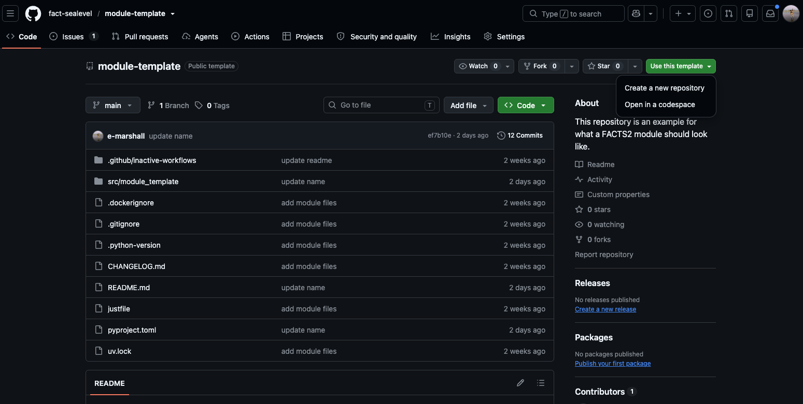
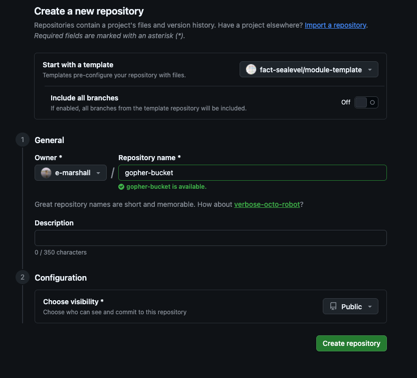
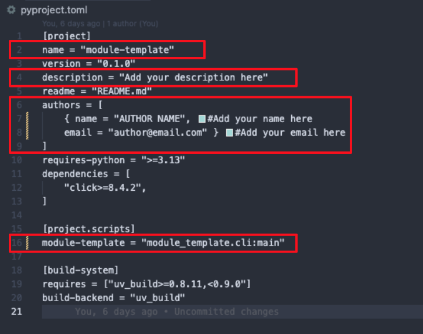
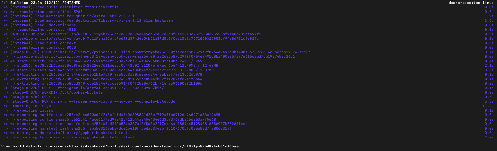

# Tutorial: Building the `gopher-buckets` module
{width="300", align=right}

!!! note
    By the end of this tutorial, we will have created a working module with all of the necessary components listed in the module requirements [document](module_requirements.md). You can find the repository created in this tutorial [here](https://github.com/fact-sealevel/gopher-buckets).

In this tutorial, we will demonstrate how to build a new FACTS module. We'll take a pretend example, the contribution of gophers dumping buckets of water into the ocean, to sea-level change. 

In our made-up example, gophers around the world engage in the activity of dumping buckets of water into the ocean (and this is not captured by any other physical process). We will call it `gopher-buckets` 🙂. 

The process is temperature-dependent and the effect of gophers on sea-level is also modified by the availability of buckets small enough to be carried by a gopher. In our model bucket size is represented by a random variable, $P$ and temperature by a random variable, $T$. For the sake of the example, this is a spatially uniform process and our module will generate projections of global mean sea level (GMSL) change due to gophers. ¯\\__(ツ)_/¯

Our example module will take input data, including a dataset of temperature projections (generated in the climate step of a FACTS experiment) and a dataset representing $$P$$, and several parameters. To be a FACTS module, it must meet the requirements listed in the FACTS module requirements [document](module_requirements.md). We'll now go through creating the module and satisfying each of the requirements. 

## 1. Create a repository for the module using the [module-template](https://github.com/fact-sealevel/module-template) in the fact-sealevel GitHub organization
- Click 'Use this template' -> 'Create new repository'
{width="500", align=center}
- Go through repository creation steps, adding a name, description, etc. 


We've just created a repository based on the provided template. It comes with several files pre-populated. Most won't need to be edit to match the name of our module but some will. 

For a more detailed explanation of the different components and files in the module template, see the [module template overview](module_template_overview.md) page.

## 2. Clone the repo locally and open in a text editor or IDE
- We've just created a repository based on the provided template. It comes with several files pre-populated. Most won't need to be edit to match the name of our module but some will. 

## 3. Update `pyproject.toml`
In the `pyproject.toml` file you'll see references to the project name `"module-template"` on lines 2 and line 16. Replace these with the name of your module, in this case, `"gopher-buckets"`. In addition, add a description and update the author name and email. On line 16, in addition to updating the moduel name, we want to update the package's executable script to be `cli.py`. Update `gopher-buckets = "gopher_buckets:main"` to be `gopher-buckets = "gopher_buckets.cli:main"`.

<figure markdown="span">
{width=500}
<figcaption>Screenshot of pyproject.toml file with highlights on lines that need to be updated from the initial module template.</figcaption>
</figure>

## 4. Update module name elsewhere in project
There are a few other locations where the original module name is hardcoded:

1. Rename the folder: `src/module_template/` becomes `src/module_buckets`  
3. In `src/module_buckets/__init__.py`: Replace "module-template" with "module-buckets" (or just delete this print statement) 
4. In the `Dockerfile`, replace instances of `"module-template"` with `"gopher-buckets"` (Lines 5 and 19). 


## 5. Add module dependencies
This is where we will add any packages that our module imports to the project virtual environment. The template has a few dependencies such as [Click](https://click.palletsprojects.com/en/stable/) and [Xarray](https://docs.xarray.dev/en/stable/) pre-loaded. Click is used to built the command-line tool for the module application and Xarray is used in the read/write functions provided in `io.py`. 

For any other package dependency in your module, run `uv add <package name>. For example:
```
uv add numpy
```

Then, run `uv sync`. You'll see that this updates the `pyproject.toml` and `uv.lock` files with the dependencies we just added.

## 6. Write / add module scripts
Now add the model's code to `src/gopher_buckets`. Note that the module template provides two scripts, `io.py` and `utils.py`. `io.py` contains functions to read and write the projections (module outputs) associated with a FACTS experiment. In the case of the gopher-buckets module, we'll use one of the IO functions (`read_climate()`) to read the climate data file input object and another, `write_gmsl_projections()` to write the module output. We can use `utils.make_gmsl_projection_ds()` to assemble the generated samples into an `xarray.Dataset` expected by `write_gmsl_projections()`. 

## 7. Make the CLI wrapper
We now have a module representing our physical model but no entrypoint. For this, we need to build the CLI tool. The module template comes with a pre-added dependency, Click, and a script, `cli.py` that we will use. 
!!! note

    In this example, we demonstrate using the Click CLI tool. If you prefer to use [argparse](https://docs.python.org/3/library/argparse.html), or another tool, feel free to do that as well.

For every parameter, input and output file in the module, we need to add a Click CLI command option. Once your module scripts are in the `src/module_name/`, build out `cli.py` to have options for all necessary parameters. Pass all options to a `main()` function. Inside the main function, you can call your module functions (See example [here]()).

## 8. Make a Docker Container
We will now create a `Dockerfile` object for our module. First, double-check that there is a `Dockerfile` in your repository. You will need to update a few lines with the name of your module. Then, ensure Docker is running on your machine. Finally, from the root directory, run `docker build -t gopher-buckets .`

You should see an output like this:


!!! caution
    The steps above work in *many* cases but not all. Creating a docker container can get much more complicated so the standard file provided in the template may need tweaking. If you run into trouble, raise an issue or post in the slack! 

## 9. Try running your module locally
Run locally in the docker container we just created:
```
docker run --rm \
    -v ./data/input:/input/:ro \
    -v ./data/output:/output \
    "gopher-buckets" \
    --scenario="ssp126" \
    --climate-data-file="/input/climate.nc" \
    --bucket-size-input-file="/input/bucket_size.csv" \
    --baseyear=2005 \
    --pyear-start=2020 \
    --pyear-end=2150 \
    --pyear-step=10 \
    --nsamps=500 \
    --rng-seed=1234 \
    --coef-a=0.5 \
    --coef-b=0.25 \
    --coef-c=1.01 \
    --coef-m=0.1 \
    --coef-n=0.01 \
    --output-gslr-file="/output/gslr.nc"
```

If it runs successfully, output data will be written in `./data/output`.

## 10. Format
Make sure justfile is present, run `just validate`. It may bring up some errors that you need to fix.
Check back soon for instructions on how to bypass and/or modify the checks in this file. 

## 11. Enable GitHub Actions

The module template comes with two GitHub Actions already configured but not enabled. The first, `pythonpackage.yaml`, runs linting and formatting. The second, `container.yaml`, is most important. This uploads the module's Docker container image to the fact-sealevel [GitHub Packages](https://github.com/orgs/fact-sealevel/packages). Doing so assigns each image a URI that can be referenced to remotely pull a module's container image (so that you do not need to locally download the source code of the FACTS module you want to run).

The files are currently in a directory called `./github/inactive_workflows`. Rename this to `./github/workflows`. When you push the renamed directory and the config files to your GitHub repository, the GitHub Actions will automatically run. 

## 12. Push to GitHub
Congrats! We've just created a working FACTS 2 module! 
You'll now want to push your work to GitHub. First, `git add` all relevant files. Then, run `git commit -m 'add a commit msg here'` and finally, `git push origin branch-name`.

## 13. Archive input data
Input data must be publicly archived with appropriate documentation and references. We recommend creating a Zenodo archive for your module's input data. See Zenodo instructions [here](https://help.zenodo.org/docs/deposit/create-new-upload/).

## 14. Issue a release of your project
*in progress, check back soon*

Versioned releases are important because they create a reference to a snapshot of the mdoule at a point in time. This is critical for referencing the software in publications and ensuring reproducibility. In the near future, this section will have more information about version naming conventions, suggestions on how to organize a changelog and making the actual release. Check back soon! 

## Recap
In this tutorial, we created a working command line application that generates projections of global mean sea level change due to a made-up physical process, gophers dumping water into the ocean. Our module has its own GitHub repository and a Dockerfile that builds the image associated with the module's software dependencies. We enabled GitHub Actions that builds the image and uploads it to the container registry. 

Head to the next tutorial to learn how to make an entry in the FACTS-module-registry for hte module we've just created.
