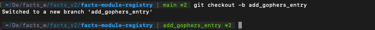
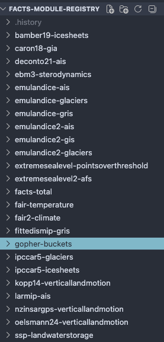
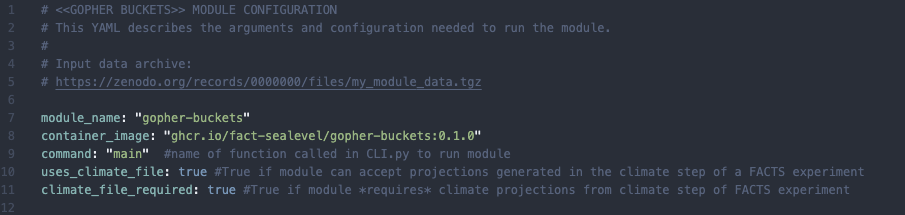

# Tutorial: Making a `gopher-buckets` entry in the FACTS-module-registry

This tutorial demonstrates how to write an entry in the [facts-module-registry](https://github.com/fact-sealevel/facts-module-registry) for a new module (If you're not familiar with the module registry, we recommend checking out the FACT-sealevel Overview [page](../fact_sealevel_overview/index.md)). We'll continue the example module we used in the previous [tutorial](build_facts_module_tutorial.md) and write an entry to add the gopher-buckets module to the FACTS-module-registry.

An entry in the module registry is a directory containing a single YAML file. The YAML file functions as a 'calling card' of the module including the versioned container image holding the module software, and information about input files and arguments, any files written by the module, and how it interacts with other modules in the FACTS2 ecosystem. 

## Preparation
Before writing a module YAML, we need the following pieces in place: 
- A container image of the working module CLI application. (ie. the end point of the previous [tutorial](build_facts_module_tutorial.md))
- The output of the module's `--help` command. Every flag in the CLI command will have its own entry as an argument in the module YAML.
- The names of the input files used in the module. These must be set (and must match the filenames used in the publicly archived module input data)

## 1. Clone facts-module-registry repo
We want to make an addition to the [FACTS-module-registry](https://github.com/fact-sealevel/facts-module-registry). To do that we'll clone the repo, add our work on a feature branch and then open a PR in FACTS-module-registry.

Clone the repo:
```
git clone git@github.com:fact-sealevel/facts-module-registry.git
```
Create a new branch for this work:


## 2. Create an entry for the module
Once you've cloned the FACTS-module-registry repository and moved to a feature branch, create a new directory for the module in the repo root next to the directories for other FACTS modules.

<figure markdown="span">

<figcaption> Screen shot of directories for each module in FACTS-module-registry</figcaption>
</figure>

## 3. Create an empty module YAML file
In the `gopher-buckets` directory, we'll create the actual entry, a yaml file called `gopher_buckets_module.yaml`. This is where we will fill in all of the information about our module. It is important that the module YAML adheres to a specific structure. For examples, you can see any of the entries already in the module registry. 

Start with the empty module yaml available [here](../fact_sealevel_overview/fmr/empty_module_yaml.md)

Copy & paste this outline into the file just created. 

## 4. Complete module YAML file

Starting with the empty module YAML, fill in information about `gopher-buckets`.

### Preamble
Replace placeholders with our module name so that the top of the module YAML looks like this:



!!! warning
    We did not issue a first release of the gopher-buckets module in the last tutorial, so line 8 is not correct. To reference the container of tagged version of our module, it must have a release. We will provide update instructions detailing these steps soon.


### Arguments section
In the arguments section, there is an entry for every flag that is passed to the module CLI. They are divided into sections: "top-level", "options", "fingerprint_params","inputs", and "outputs". You can read more about the different sections in the [About Module YAML Files](../fact_sealevel_overview/fmr/about_module_registry_entry.md) page. What is important to know right now is that each entry must have at least the following fields:

```yaml
- name: "flag_name" # corresponds to name of CLI flag. "flag_name" becomes --flag-name
  type: #type of arg: str | int | float | bool | file
  source: 
```
`source` tells FEB where to read for this field from when it creates and pre-populates an experiment config file. If `module_inputs`, value comes from the module yaml (this file), if `metadata`, value comes from args passed to the FEB CLI command, setup-experiment. 

### Volumes section

The final section of the module YAML lists any named bind mounts that are referenced in the arguments passed to the module. If an entry in the `inputs` or `outputs` sub-sections of the `arguments` section contains **`mount.volume`**, it must be listed as a key here. The values, `host_path`, `container_path`, and `help` instruct FEB how to resolve the host and mounted paths and pass the help message describing the volume to the experiment configuration file.

## Open a Pull Request in FACTS-module-registry
Once you have completed the module YAML file, open a PR in the FACTS-module-registry repo. A maintainer will review it. In the future, we hope to implement a tool to automatically check/validate new module yaml entries.  